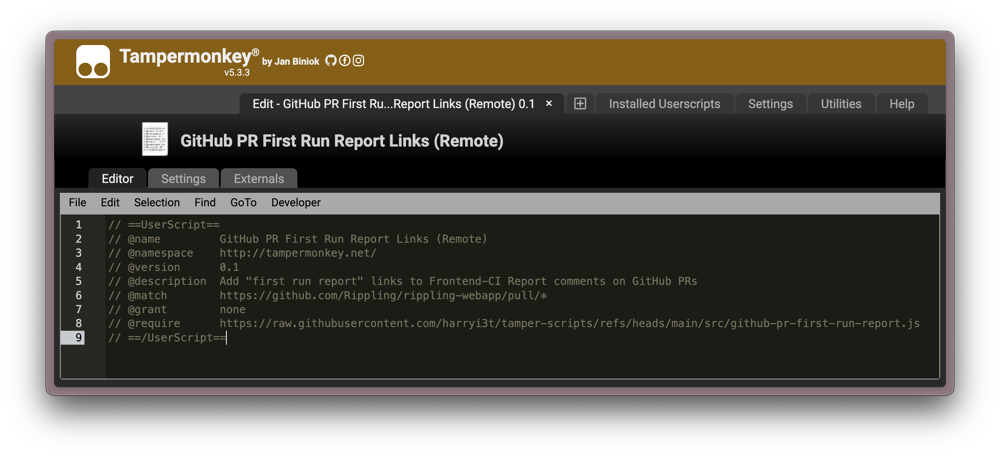

# Tamper Scripts

A collection of Tampermonkey userscripts and remote loaders for customizing and automating web-based workflows.

## Introduction

This repository contains a set of Tampermonkey userscripts to enhance various web-based tooling. Each script has two components:

1. `src/<slug>.js` – The actual userscript code.
2. `<slug>-remote.js` – A remote loader that `@require`s the script directly from Github or from local file system during development.

Available scripts:

- **buildkite-first-run-report** – Generates a report for the first Buildkite run of a pipeline.
- **github-pr-first-run-report** – Adds a summary report on the first load of a GitHub Pull Request.
- **sentry-copy-on-call** – Provides a one-click copy button for event contexts in Sentry.

## Directory Structure

```bash
.
├── src
│   ├── some-script.js
├── remote
│   ├── some-script-remote.js
└── README.md
```

## Usage

1. Install the Tampermonkey extension in your browser.
2. Open the Tampermonkey dashboard and click **Add a new script**.
   
3. Replace the default template with your remote loader URL. For example:
   
4. Save the script. It will automatically run on matching pages the next time you visit them.

## Development

- Modify the code in `src/<slug>.js`.
- While developing, update the `@require` in your Tampermonkey script to point to your local file.

   ```js
   // @require file:///<path-to-tamper-scripts>/src/<slug>.js
   ```

## Publishing

1. Push your changes to GitHub.
2. Ensure that the `@require` in your Tampermonkey script points to the raw GitHub URL:

   ```js
   // @require https://raw.githubusercontent.com/harryi3t/tamper-scripts/refs/heads/main/src/<slug>.js
   ```

## Contributing

Contributions are welcome! Feel free to open issues, feature requests, or pull requests.

